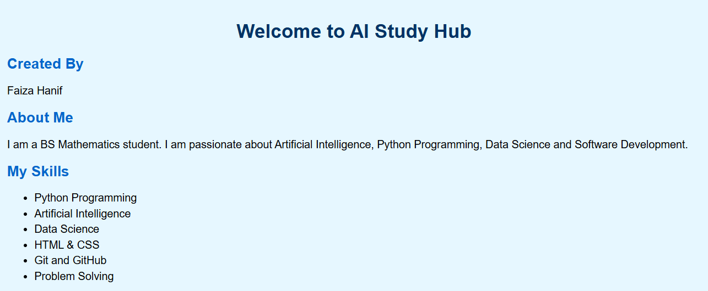

# 🤖 AI Study Hub

<p align="center">

# 🌟 AI Study Hub

A modern Python + Web Development project created by **Faiza Hanif**.

Learning Python • AI • Machine Learning • Web Development

</p>

---

## 📖 About Project

AI Study Hub is a learning platform developed using Python and Web technologies.

This project helps students perform useful academic tasks from one place.

---

## ✨ Features

✅ Student Dashboard

✅ CGPA Calculator

✅ Smart Calculator

✅ AI Assistant

✅ Study Planner

✅ Responsive Website

---

## 🛠 Technologies

- Python
- HTML5
- CSS3
- JavaScript
- Git
- GitHub
- VS Code

---

## 📂 Project Structure

```
AI_Study_Hub/
│
├── index.html
├── style.css
├── script.js
├── main.py
├── student_dashboard.py
├── ai_assistant.py
├── cgpa_calculator.py
├── smart_calculator.py
├── study_planner.py
├── images/
│   ├── homepage.png
│   └── secondpage.png
└── README.md
```

---

# 📸 Project Preview

## 🏠 Home Page



## 📊 Second Page


---

## 🎯 Future Improvements

- AI Chatbot
- Voice Assistant
- Login System
- Database Integration
- Machine Learning Models
- Data Visualization
- Mobile App Version

---

## 👩‍💻 Developer

**Faiza Hanif**

BS Mathematics Student

Learning:

- Python
- Artificial Intelligence
- Machine Learning
- Data Science
- Web Development

---

## ⭐ Support

If you like this project, please give it a ⭐ on GitHub.

Thank you for visiting my repository!
# 🧠 Project 2 - AI Quiz Generator

## 📌 Description

AI Quiz Generator is a Python-based quiz application that allows users to test their knowledge in different subjects.

### ✨ Features

- 📚 Mathematics Quiz
- 📖 English Quiz
- 🔬 Science Quiz
- 📊 Automatic Score Calculation
- 📈 Percentage
- 🏆 Grade System
- 💡 Motivational Message
- 🔄 Easy-to-use Menu

---

## 📸 Project Screenshots

### Main Menu


### Quiz Result


---

## 🛠️ Technologies Used

- Python
- GitHub
- VS Code

---

More AI and Python projects will be added soon. 🚀
